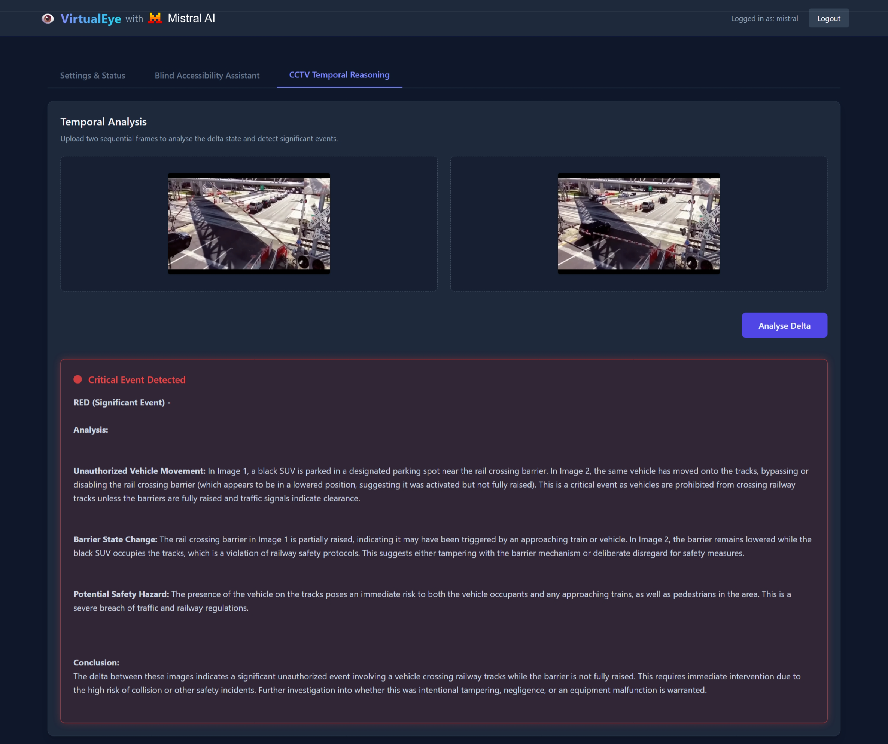

# VirtualEye: Privacy-First CCTV Intelligence & Accessibility

Welcome to **VirtualEye**, a concept project built for the 2026 Hackathon showcasing real-world, high-impact use-cases of local Large Language Models (LLMs). This project focuses on delivering powerful, privacy-preserving AI tools directly at the edge, requiring no cloud dependencies so that privacy is maximised.

## 🚀 The Concepts

This project integrates two distinct yet powerful AI-driven capabilities into a single seamless application:

### 1. The "Blind-Accessibility" Assistant
An assistant designed to help visually impaired users navigate complex software interfaces or physical environments. Users upload a screenshot of a UI or a photo of a room.
- **The Logic:** The LLM receives a strict system prompt instructing it to act as a high-detail spatial describer using relative positioning (top-left, center, bottom-right). (*Example: 'There is a large blue Submit button in the bottom right corner'*).
- **Hackathon Hook:** *"AI-driven inclusivity at the edge."*

### 2. The "VirtualEye" CCTV Incident Reporter
A portal that performs **Temporal Reasoning** on still frames. Instead of describing images in isolation, the model analyses the delta (change) between them to infer critical events.
- **The Logic:** *"In Image 1, the gate is closed. In Image 2, the gate is open and a person is running."*
- **Output:** `RED (Significant Event) – Unauthorized entry detected via gate breach.`
- **Hackathon Hook:** *"Local, private security intelligence."*

*(Note: While VirtualEye is firmly designed to champion edge computing to guarantee data privacy, the application also fully supports routing requests to Mistral's global Cloud API endpoints (`api.mistral.ai`) via the internal Settings UI for testing, benchmarking, or scalable deployments).*

## ⚖️ European Compliance Advantage

By executing Large Language Models at the edge (locally on the user's hardware) rather than relying on cloud providers, VirtualEye offers native architectural advantages under strict European data laws:

### General Data Protection Regulation (GDPR)
- **Data Minimisation ([Article 5(1)(c)](https://gdpr-info.eu/art-5-gdpr/)):** Personal data (such as faces in CCTV footage or private details in accessibility room photos) is processed instantaneously and discarded. By never transmitting biometric or sensitive data to a third-party cloud bucket, the system inherently minimises data exposure.
- **Data Protection by Design and by Default ([Article 25](https://gdpr-info.eu/art-25-gdpr/)):** The fundamental architecture protects user privacy automatically. The "default" state ensures no data leaves the local network boundary, stripping away the friction of complex user consent mechanisms that cloud processing requires.
- **Security of Processing ([Article 32](https://gdpr-info.eu/art-32-gdpr/)):** By eliminating data-in-transit over the public internet to third-party APIs, the risk of interception, man-in-the-middle attacks, or external cloud data breaches is drastically reduced.

### EU Data Act
- **User Control & Access ([Chapter II / Article 4](https://eur-lex.europa.eu/eli/reg/2023/2854/oj)):** The EU Data Act mandates that users have immediate, full control over the data generated by their connected devices. VirtualEye’s local-first architecture means the user *is* the data holder. There is no vendor lock-in or third-party gatekeeper preventing the user from accessing, modifying, or securing their own operational data.
- **Protection Against Unlawful Third-Country Access ([Chapter VII](https://eur-lex.europa.eu/eli/reg/2023/2854/oj)):** Because data never leaves the local environment, the risk of non-personal operational data being unlawfully accessed by foreign governments (a key concern addressed by the Data Act regarding international cloud providers) is completely eliminated.

## 🛠️ Project Framework

- **Dual LLM Backend Flexibility:** Interactions are powered by Mistral's vision-compatible models (e.g., `ministral-3-14b-reasoning`, `pixtral-12b`). The application dynamically routes API fetch calls to either a local edge node via [LMStudio](https://lmstudio.ai) (`http://192.168.1.3:1234/v1`) or the global Mistral API Cloud (`https://api.mistral.ai/v1`) directly from the browser.
- **Frontend/Web Framework:** A lightweight, **stateless** Python-driven web application using **PyScript** (WebAssembly) and **Tailwind CSS**. Python executes entirely client-side.
- **Dynamic Configuration & Resilience:** Features a dedicated `Settings & Status` UI tab to validate model availability, handle API Key injections, and gracefully manage Cloud API Rate Limits via exponential backoff retry loops. Markdown LLM responses are natively rendered via `marked.js`.
- **Authentication:** Strict login requirement per session. Credentials are securely managed via a plain-text file storing usernames and hashed passwords (client-side validation).
- **Hosting & Deployment:** The application relies entirely on static resources, allowing it to be continuously built and deployed via **GitHub Actions** and hosted on **[GitHub Pages](https://nvatvani.github.io/mistral-hackathon-2026-virtualeye/)**.

### Repository Structure

```text
mistral-hackathon-2026-virtualeye/
├── .github/
│   └── workflows/          # GitHub Actions CI/CD pipelines
├── app/                    # Main application source code
│   ├── index.html          # Entry point for the static web app (UI layout & PyScript load)
│   ├── config.json         # Default configuration parameters (Endpoints, Model ID)
│   ├── static/             # CSS styling variables and custom SVGs
│   │   └── style.css
│   ├── auth/               # Core Application Logic
│   │   └── main.py         # PyScript backend (Login, API fetching, Async rate limits, DOM manipulation)
│   └── data/               # Plain-text data models
│       └── users.txt       # Plain-text credentials file (username:hashed_password)
├── pyproject.toml          # Optional local testing dependencies
├── LICENSE                 # Apache 2.0 License
└── README.md               # Project documentation
```

## 💻 Quick Start

### Prerequisites
- **Local Route:** [LMStudio](https://lmstudio.ai/) running locally (e.g. on `192.168.1.3` at port `1234`), with a Vision-compatible model loaded.
- **Cloud Route:** An active API Key for Mistral's La Plateforme targeting `api.mistral.ai`. 
- [uv](https://github.com/astral-sh/uv) (Extremely fast Python package installer and resolver) to spin up local development environments quickly.

### Installation & Setup

1. **Clone the repository:**
   ```bash
   git clone https://github.com/nvatvani/mistral-hackathon-2026-virtualeye.git
   cd mistral-hackathon-2026-virtualeye
   ```

2. **Initialize a virtual environment:**
   Use `uv` to create a virtual environment with a custom prompt.
   ```bash
   uv venv --prompt "mistral-hackathon-2026-virtualeye"
   ```

3. **Activate the environment:**
   - **Linux/macOS:**
     ```bash
     source .venv/bin/activate
     ```
   - **Windows:**
     ```cmd
     .venv\Scripts\activate
     ```

4. **Install optional local dependencies (Optional):**
   Using `uv`, sync the necessary project requirements from `pyproject.toml` if planning to run local `pytest` suites.
   ```bash
   uv pip sync pyproject.toml
   ```

5. **Start the local server:**
   Because VirtualEye relies purely on client-side PyScript (WebAssembly), it requires no heavy backend. Serve the static application locally over HTTP:
   ```bash
   python -m http.server 8080 --directory app
   ```

### Configuration & Usage

1. **Access:**
   - **Local Setup:**
      - Navigate to `http://localhost:8080` in your browser.
      - Login using your configured credentials (e.g. `admin` / `admin`).

   - **Using [GitHub Pages](https://nvatvani.github.io/mistral-hackathon-2026-virtualeye/):**
      - Navigate to `https://nvatvani.github.io/mistral-hackathon-2026-virtualeye/` in your browser and proceed to Login.

      *Note:* Credentials are hashed and only Hackathon Judges will know the plaintext details.

      

2. **Login & Configuration:**
   - Once logged-in, be ***VERY CAREFUL*** about refreshing the page because this is a **stateless** application and you will ***lose your session***, forcing you to login again.
   
   - Use the **Settings & Status** tab to map your desired API Endpoint (LMStudio vs MistralAI Cloud API) and input your Bearer API Key if utilizing Mistral La Plateforme. Click **Verify Connection** to test network continuity before attempting to use the features!
      - **LMStudio:**
         - Make sure you are using a Web-Browser that supports LNA (Local Network Access) like Microsoft Edge / Google Chrome.
         

         - An LNA-enabled browser will allow you to access the LMStudio API running on your local network.
         I will not be going through the setup of LMStudio as it is beyond the scope of this hackathon. However, I can indicate that you can setup LMStudio to either employ or omit API-keys as described in the [LMStudio documentation](https://lmstudio.ai/docs/developer/core/server).
         If you are using a web-browser that does not support LNA, can either run the application locally as described in  **5. Start the local server** or use **MistralAI Cloud API** settings instead.
      - **MistralAI Cloud API:**
         
         I will not be going through the provisioning of the MistralAI Cloud API-key because that process is already documented on the [MistralAI website](https://docs.mistral.ai/getting-started/quickstart).

3. **Blind Accessibility Assistant:**
   - Once the LLM connectivity is verified, navigate to the **Blind Accessibility Assistant** tab.
   
   - Click on the **Upload Image** button to upload an image.
   - The image will be displayed in the image container.
   
   - Click on the **Generate Spatial Description** button and wait for the model to respond.
   
   - The response from the model will be displayed in the answer container.
   

4. **CCTV Temporal Reasoning:**
   - Once the LLM connectivity is verified, navigate to the **CCTV Temporal Reasoning** tab.
   
   - Click on the **Upload Image** button to upload an image.
   - The images will be displayed in the respective image containers.
   
   - Click on the **Analyse Delta** button and wait for the model to respond.
   
   - The response from the model will be displayed in the answer container.
   

### Frequently Asked Questions (FAQ)

1. Sometimes MistralAI Cloud API returns an error message "429 Too Many Requests". What should I do?
   - Wait for some time and try again.
   
   - Check https://status.mistral.ai/ to rule out any ongoing issues with the MistralAI Cloud API.

2. Sometime LMStudio returns an error "400 Bad Request". What should I do?
   - This seems to be a bug with LMStudio. A known workaround is to eject the model, load it again, and then press the **Analyse Delta** or **Generate Spatial Description** buttons again.

## 📄 License
This project is licensed under the **Apache 2.0 License** - see the [LICENSE](LICENSE) file for details.
